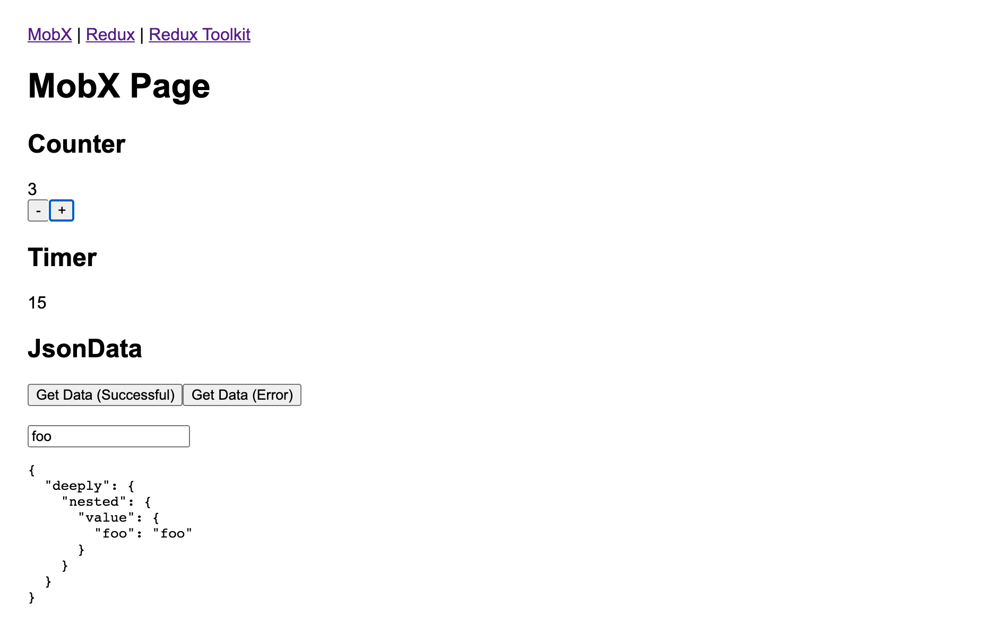

# experiments-redux-vs-mobx 

This project provides an easy way to compare:  
1. Redux
2. Redux Toolkit
3. MobX

There are a few examples built in each of these technologies:  
1. A simple counter with a plus and minus button
2. A timer that increases every second
3. Buttons to simulate fetching some JSON data asynchronously via XHR - or failing
4. An input field to edit a deeply nested field in the JSON

Open the examples and compare the different solutions. Do a search for "NOTE" and read them. You'll see how much simpler, clearer, and more straightforward MobX is.

---

## Prerequisites
- Node v12+

## Setup
- `npm install`

## Run
- `npm start`
- Open `http://localhost:3000/` in your browser

---

## Credits
- Original code generated using Create React App

---

